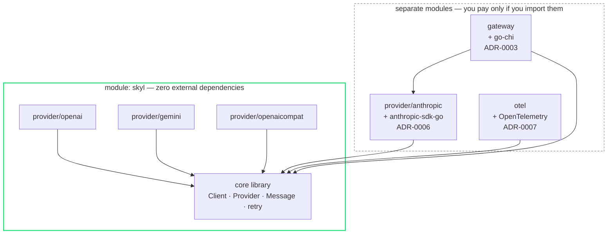
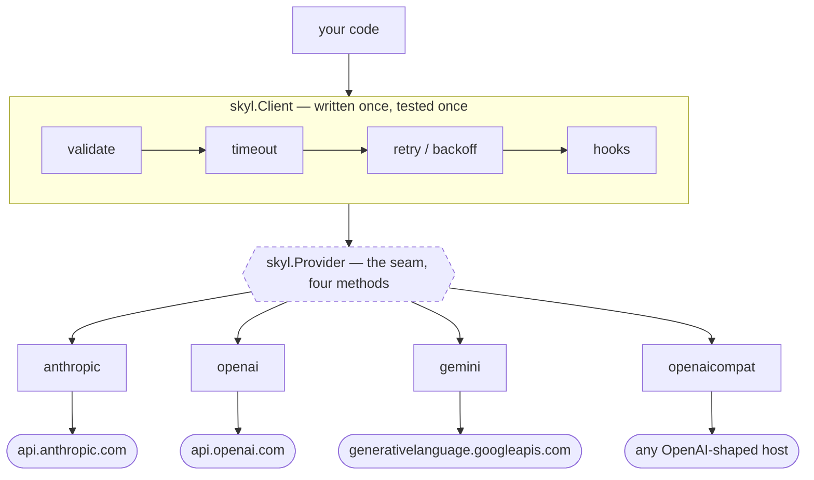
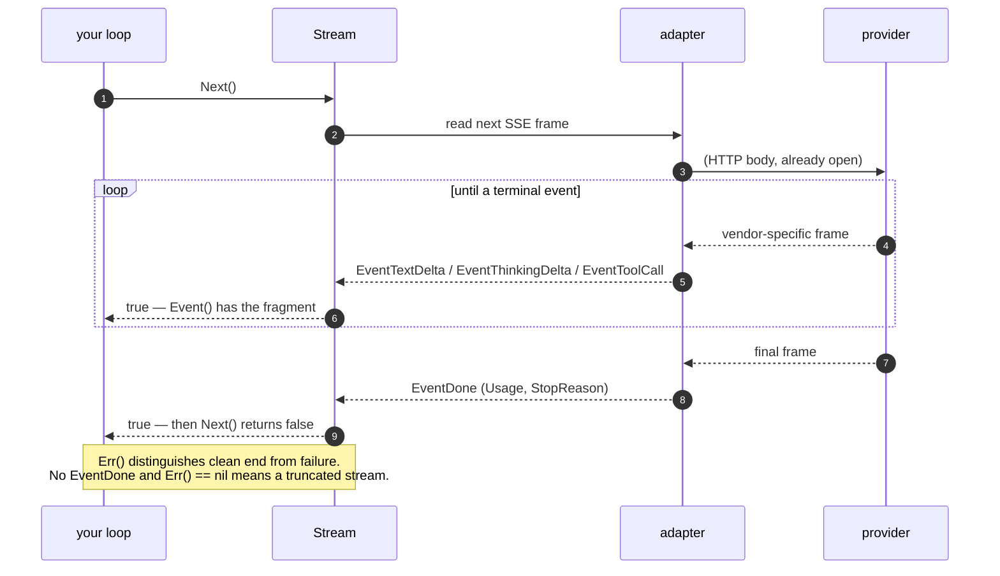
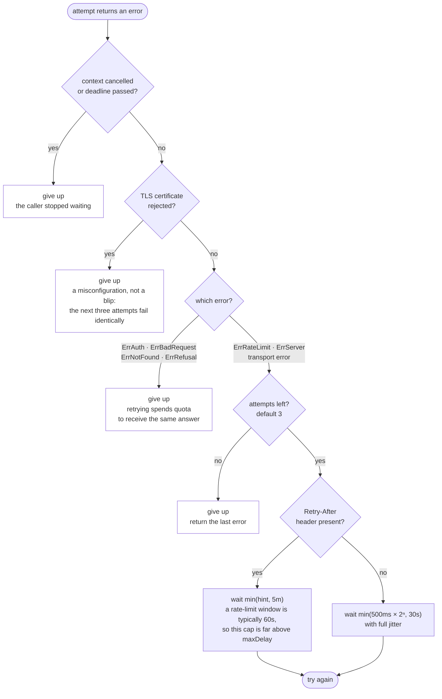

# Architecture

## Layout

skyl is **three Go modules** in one repository: the library, the Anthropic
adapter (which carries the official SDK's dependencies), and the gateway.

```
skyl/                                  module github.com/BAGOMBEKA-JOB-DEV/skyl
├── skyl.go            Client, options, orchestration
├── message.go         Message, Part, Role — the conversation model
├── request.go         Request, Tool, ToolChoice, Thinking
├── response.go        Response, Usage, StopReason
├── provider.go        the Provider interface — the seam
├── stream.go          Stream interface + event types
├── errors.go          typed, classified errors
├── retry.go           backoff policy
│                      (ModelInfo lives in response.go; the generated model
│                       registry is still a roadmap item, not a file)
│
├── provider/
│   ├── anthropic/     native adapter  ← own go.mod (ADR-0006)
│   ├── openai/        native adapter
│   ├── gemini/        native adapter
│   └── openaicompat/  generic adapter for OpenAI-shaped endpoints
│
├── internal/
│   ├── oai/           the OpenAI chat-completions wire format, shared by
│   │                  provider/openai and provider/openaicompat
│   ├── sse/           Server-Sent Events reader
│   ├── httpx/         shared HTTP helpers
│   ├── sandbox/       local server speaking all four wire protocols
│   ├── providertest/  the contract suite every adapter must pass
│   └── testutil/      goroutine-leak assertions
│
├── cmd/skyl-sandbox/  runs the sandbox (docs/sandbox.md)
│
└── gateway/                           module .../skyl/gateway  ← separate go.mod
    ├── server.go      chi router, handlers
    ├── config.go      provider wiring from env
    └── cmd/skyl-gateway/
```

The module split is deliberate: `go get` on the core library pulls in neither
chi nor the Anthropic SDK, and the core module has zero external dependencies.
See [ADR-0003](adr/0003-gateway-as-separate-module.md) and
[ADR-0006](adr/0006-anthropic-adapter-is-its-own-module.md).

The tree above shows where files sit. What matters more is which way the
dependency arrows point — every heavy dependency is quarantined in a module you
only pay for by importing it:



Arrows point at what a module depends on. Nothing points *out* of the green
box, which is the property the split exists to protect: adding a vendor SDK to
`provider/anthropic` can never make the core library heavier.

The three adapters inside the green box are there because they need nothing but
`net/http` — they speak their vendors' wire protocols directly. `anthropic` is
outside it only because the official SDK is worth its weight for that one
provider.

## The seam

Everything in skyl exists to serve one interface:

```go
type Provider interface {
	Name() string
	Complete(ctx context.Context, req *Request) (*Response, error)
	Stream(ctx context.Context, req *Request) (Stream, error)
	Models(ctx context.Context) ([]ModelInfo, error)
}
```

Four methods. An adapter's whole job is translating `*Request` into a vendor
call and the vendor's reply back into `*Response`.

This is a small interface on purpose. It is easy to implement (a third-party
adapter living outside this repo is a first-class citizen), easy to fake in
tests, and easy to wrap — `Client` middleware, the gateway, and every test
double all compose against the same four methods.

### Why `Client` is not the interface

`Client` wraps a `Provider` and adds retry, timeouts, hooks, and validation.
Keeping those in `Client` rather than in each adapter means:

- Retry logic is written and tested **once**, not once per vendor.
- A new adapter gets production-grade behaviour for free.
- Users who want raw access can call the `Provider` directly.



Read it top to bottom: everything above the dashed seam happens once, for every
provider. Everything below it is translation and nothing else. An adapter that
tried to implement its own retry would be duplicating the band above it — which
is why `Provider` has four methods and no hooks of its own.

## The conversation model

The hardest design problem in a multi-provider library is representing a
message, because vendors disagree. OpenAI historically used a flat `content`
string; Anthropic uses typed content blocks; Gemini uses `parts` under
`contents` and calls the assistant role `model`.

skyl models the **superset**: a message is a role plus an ordered list of parts.

```go
type Message struct {
	Role  Role
	Parts []Part
}
```

`Part` is a closed interface (unexported marker method) implemented by `Text`,
`Image`, `ToolCall`, and `ToolResult`. Closed because an open one would let
callers construct parts that no adapter can render, turning a compile-time
error into a runtime one.

Flattening to a simpler vendor shape is lossless for the common case and
explicit where it isn't: an adapter that cannot represent a part returns
`ErrUnsupported` naming the part, rather than silently dropping it. **Silent
data loss is the worst possible failure mode for this library** — a dropped
image looks like a model that ignored your question.

## Errors

Classification matters more than message text, because callers branch on it.

```go
var (
	ErrAuth        = errors.New("skyl: authentication failed")
	ErrRateLimit   = errors.New("skyl: rate limited")
	ErrNotFound    = errors.New("skyl: model not found")
	ErrBadRequest  = errors.New("skyl: invalid request")
	ErrServer      = errors.New("skyl: provider server error")
	ErrUnsupported = errors.New("skyl: unsupported by this provider")
	ErrRefusal     = errors.New("skyl: model declined the request")
)
```

Adapters map vendor errors onto these and wrap them in `*Error`, which carries
the provider name, HTTP status, retry-after hint, and the raw body:

```go
if errors.Is(err, skyl.ErrRateLimit) {
	var e *skyl.Error
	errors.As(err, &e)
	time.Sleep(e.RetryAfter)
}
```

Retryability is a property of the classification, not of string matching on the
message — so `Client`'s retry loop works identically across vendors.

## Streaming

`Stream` is a pull iterator, which composes with `defer` and context
cancellation the way Go programmers expect:

```go
type Stream interface {
	Next() bool
	Event() StreamEvent
	Err() error
	Close() error
}
```

Rather than a channel. Channels look idiomatic here but make cancellation and
error propagation awkward — you need a second channel for errors, and closing
cleanly on early return is easy to get wrong. Every skyl stream is safe to
abandon early: `Close()` releases the HTTP body, and the reader goroutine is
tied to the request context, so **no stream can leak**. This is enforced by a
goroutine-leak test, not just by convention.

Four event types, and one of them is terminal. The shape below is identical
whichever provider answered — normalising three different vendor event
vocabularies into this sequence is most of what a streaming adapter does:



That last note is the case worth designing for. A stream can end *without*
`EventDone` — the connection dropped mid-generation — and `Next()` returning
false does not by itself tell you which happened. Always check `Err()`, and
treat "no `EventDone`" as truncation rather than success.

## Retry

`Client` retries idempotent failures with exponential backoff and full jitter,
honouring `Retry-After` when the provider sends one.

Retried: `ErrRateLimit`, `ErrServer`, connection errors.
Never retried: `ErrAuth`, `ErrBadRequest`, `ErrNotFound`, `ErrRefusal` — retrying
these burns quota to get the same answer.

Backoff is `min(base * 2^n, max)` with full jitter. Jitter is not optional: a
fleet that retries on a fixed schedule reconverges into a thundering herd
against a provider that is already struggling.

The decision in full. Note how many paths lead to *give up* — the conservative
default is the point, because a library that retries hard turns a provider's bad
minute into its bad hour:



The two caps answer different questions and so are configured separately:
`maxDelay` is how long *we choose* to wait; `retryAfterCap` is how long we let a
*provider* make us wait. Clamping a provider's 60-second hint down to the
30-second jitter ceiling would retry inside a window it has already told us is
closed, spending the entire retry budget collecting the same 429 four times.

## Concurrency

`Client` and every adapter are **safe for concurrent use by multiple
goroutines**. They hold no mutable per-request state; everything scoped to a
call lives on the stack. The underlying `*http.Client` is shared, which is
correct and intended — it is how connection pooling happens.

A `Stream`, by contrast, is **not** safe for concurrent use. One stream, one
consuming goroutine.

## Testing strategy

- **No network in unit tests.** Every adapter test runs against
  `httptest.Server` replaying recorded provider payloads.
- **Error paths are tested as thoroughly as success paths** — every branch of
  the error classifier has a case.
- **`-race` on every package, in CI**, on every push.
- **Leak checks** on streaming, because a leaked goroutine per request is the
  kind of bug that only shows up in production at 3am.
- **Every adapter has been exercised against its live provider** (2026-08-05).
  This matters because the rest of the suite structurally cannot prove it: an
  adapter test replays payloads written from provider documentation, so it
  verifies skyl's *mapping* logic while a fake echoes our own assumptions back
  at us. A wrong field name is wrong identically in both and stays green.
- Live tests are build-tagged `integration` and excluded from default CI,
  because they cost money and need real keys. They are a snapshot rather than a
  standing guarantee — see [validating.md](validating.md) to re-run them, and
  note that no cassettes are recorded yet, so nothing replays that proof for
  free.

See [rules.md](rules.md) for the full standard.

## See also

Design rationale is here; the operational and evaluation material lives
alongside it:

- [feature-matrix.md](feature-matrix.md) — what the adapters actually do, per
  capability, including their gaps
- [gateway.md](gateway.md) — configuration, endpoints and the operational runbook
- [data-handling.md](data-handling.md) and [threat-model.md](threat-model.md)
- [benchmarks.md](benchmarks.md) — the cost of the hot paths described above
